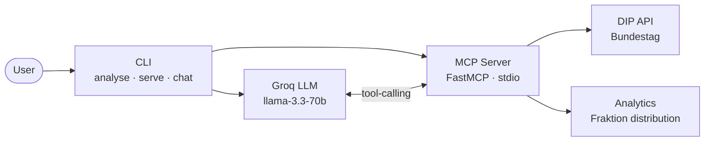

# DIP Parliamentary Analyser

   

DIP Parliamentary Analyser answers questions about German Bundestag composition using live open data and a conversational AI interface.

A production oriented proof-of-concept that connects to the **German Bundestag DIP API**, analyses Fraktion (parliamentary group) membership distribution, and exposes the analysis through an **MCP (Model Context Protocol)** server with **Groq LLM** tool-calling.

---

## Project Overview

The system fetches real politician data from the official German Bundestag open-data API, determines each politician's Fraktion membership, computes percentage distribution across all parliamentary groups, and uses a large language model to generate a human-readable German-language summary.

Three core interaction modes (task requirements):

- **`analyse`** — one-shot CLI command that fetches data, computes distribution, and generates an LLM summary
- **`serve`** — exposes MCP tools over stdio transport so any MCP-compatible client (e.g. Claude Desktop) can call them
- **`chat`** — interactive REPL where the LLM automatically selects and calls the right tool based on your natural language question

**Key technologies:** Python 3.11, FastMCP, Groq (`llama-3.3-70b-versatile`), httpx, Pydantic v2, Rich, Typer, Poetry, Docker.

---

## Requirement Mapping

| Challenge Requirement | Implementation | Location |
|---|---|---|
| Connect to DIP Bundestag API | Async httpx client with pagination & retries | `api/client.py` |
| Fetch person / Fraktion data | `get_persons()` — cursor-paginated, Pydantic-validated | `api/client.py` |
| Compute Fraktion distribution | `build_distribution_report()` using `Counter` | `core/analytics.py` |
| MCP server with tools | FastMCP server, stdio transport (MCP-compliant) | `mcp/server.py` |
| `get_fraktion_distribution` tool | Returns per-Fraktion counts and percentages | `mcp/server.py` |
| `get_person_info` tool | Biographical and parliamentary lookup by name | `mcp/server.py` |
| LLM-generated summary | Groq `llama-3.3-70b-versatile`, German-language output | `llm/groq_client.py` |
| Bonus — tool-calling chat | `chat` mode: Groq autonomously selects and calls MCP tools | `cli/chat.py` |

---

## Prerequisites

| Requirement | Version | Notes |
|---|---|---|
| Python | 3.11+ | |
| Poetry | 1.8+ | Dependency and packaging manager |
| DIP API key | — | German Bundestag open-data portal |
| Groq API key | — | Free at console.groq.com |
| Docker | 24+ | Optional — for containerised runs |
| Streamlit | — | Optional — for BundesBot UI (`pip install streamlit`) |

**Where to get your keys:**
- **DIP API key:** Register at [dip.bundestag.de](https://dip.bundestag.de) or use the public demo key available in the portal documentation.
- **Groq API key:** Create a free account at [console.groq.com](https://console.groq.com) and generate an API key under *API Keys*.

---

## Installation

```bash
# 1. Clone the repository
git clone https://github.com/Indrasena-reddy/DIP-mcp.git
cd DIP-mcp

# 2. Copy the environment file and fill in your API keys
cp .env.example .env        # Linux/Mac
copy .env.example .env      # Windows

# 3. Install dependencies
poetry install
```

Open `.env` and replace the placeholder values:

```
DIP_API_KEY=your_dip_api_key_here
GROQ_API_KEY=your_groq_api_key_here
```

---

## Configuration

All configuration is read from environment variables (or the `.env` file). Never commit `.env` to version control — it is listed in `.gitignore`.

| Variable | Required | Default | Description |
|---|---|---|---|
| `DIP_API_KEY` | Yes | — | German Bundestag DIP API key |
| `GROQ_API_KEY` | Yes | — | Groq LLM API key |
| `DIP_API_BASE_URL` | No | `https://search.dip.bundestag.de/api/v1` | DIP API base URL |
| `GROQ_MODEL` | No | `llama-3.3-70b-versatile` | Groq model identifier |
| `LOG_LEVEL` | No | `INFO` | Python logging level |
| `REQUEST_TIMEOUT_SECONDS` | No | `30` | HTTP request timeout |
| `MAX_CONCURRENT_REQUESTS` | No | `5` | Max parallel DIP API requests |

---

## Usage

### Analyse — fetch distribution and generate LLM summary

```bash
poetry run dip-mcp analyse --wahlperiode 20
```

Fetches all politicians for Wahlperiode 20 (2021–2025), computes the Fraktion distribution table, and generates a German-language summary via Groq. The `--wahlperiode` / `-w` flag accepts any valid election period number.

```bash
# Example: analyse Wahlperiode 19 (2017–2021)
poetry run dip-mcp analyse --wahlperiode 19
```

### Serve — start the MCP server

```bash
poetry run dip-mcp serve
```

Starts the MCP server on **stdio transport (MCP-compliant)**. Connect any MCP-compatible client (e.g. Claude Desktop, an MCP inspector) to this process. Two tools are registered:

| Tool | Description |
|---|---|
| `get_fraktion_distribution` | Fraktion distribution for a given Wahlperiode |
| `get_person_info` | Biographical and parliamentary data for a politician by name |

### Chat — interactive natural language assistant

```bash
poetry run dip-mcp chat
```

Starts an interactive REPL. Ask questions in natural language (German or English). The LLM automatically selects the correct tool, fetches live data from the DIP API, and returns a formatted answer.

Example questions:
- *Wie ist die Fraktionsverteilung in der 20. Wahlperiode?*
- *Wer ist Friedrich Merz?*
- *Which parties are in the Bundestag?*

Type `exit`, `quit`, or press `Ctrl+C` to quit.

---

## Example Output

### `analyse` — Fraktion distribution table

```
┏━━━━━━━━━━━━━━━━━━━━━━━━━━━━━━━━━━┳━━━━━━━━━┳━━━━━━━━━━━━┓
┃ Fraktion                         ┃ Persons ┃ Percentage ┃
┡━━━━━━━━━━━━━━━━━━━━━━━━━━━━━━━━━━╇━━━━━━━━━╇━━━━━━━━━━━━┩
│ CDU/CSU                          │     197 │     26.50% │
│ SPD                              │     206 │     27.72% │
│ AfD                              │      83 │     11.17% │
│ FDP                              │      92 │     12.38% │
│ DIE LINKE.                       │      38 │      5.11% │
│ BÜNDNIS 90/DIE GRÜNEN            │     118 │     15.88% │
│ fraktionslos                     │       9 │      1.21% │
└──────────────────────────────────┴─────────┴────────────┘
Total: 743 persons (9 unaffiliated)
```

Followed by a German-language AI summary generated by Groq.

### `chat` — natural language Q&A

```
You: Who is Friedrich Merz?

BundesBot: Friedrich Merz (born 11 November 1955 in Brilon) is a German politician
and member of the CDU/CSU Fraktion in the 20th Wahlperiode. He has served as a
lawyer and has been a member of the Bundestag since 2021.

You: Wie ist die Fraktionsverteilung in der 20. Wahlperiode?

BundesBot: In der 20. Wahlperiode (2021–2025) verteilen sich die 743 Mitglieder
des Deutschen Bundestages wie folgt: SPD 27,72 %, CDU/CSU 26,50 %,
BÜNDNIS 90/DIE GRÜNEN 15,88 %, FDP 12,38 %, AfD 11,17 %,
DIE LINKE. 5,11 % und 9 fraktionslose Abgeordnete (1,21 %).
```

---

## Architecture

### System diagram



The system is organised into four independent layers:

**DIP API layer** (`api/`) — An async httpx client with cursor-based pagination, a tenacity retry decorator (retries only on 5xx server errors), and an anyio semaphore for bounded concurrency. Pydantic v2 validates every document returned by the API.

**Analytics layer** (`core/`) — Pure Python functions that count Fraktion membership using a `Counter`, calculate percentage shares, and build a validated `DistributionReport` model. No external dependencies.

**MCP layer** (`mcp/`) — A FastMCP server that exposes two tools over stdio transport. All tool calls — both from the chat REPL and from external MCP clients — are routed through `FastMCP.call_tool()`, so every invocation genuinely flows through the MCP protocol layer. Person data is cached in-process per Wahlperiode to avoid redundant API fetches.

**LLM layer** (`llm/`) — An async Groq client that supports two interaction patterns: (1) single-shot summarisation of a finished distribution report, and (2) multi-turn tool-calling where Groq selects which MCP tool to invoke and composes the final answer from the tool result.

### Data flow (chat mode)

```
User question
    → Groq (tool selection)          — first LLM call
    → _dispatch_tool()
    → FastMCP.call_tool()            — MCP protocol layer
    → tools.py (_get_persons cache)
        → DipApiClient → DIP API     — cursor-paginated fetch (first request only)
        → client-side WP filter      — keeps only members of requested period
    → analytics.py                   — WP-specific Fraktion distribution
    → Groq (answer composition)      — second LLM call
    → displayed to user
```

### Project structure

```
src/dip_mcp/
├── api/
│   ├── client.py       # Async DIP API client with pagination and retries
│   └── models.py       # Pydantic v2 data models
├── cli/
│   ├── app.py          # Typer root application and command registration
│   ├── analyse.py      # analyse command — end-to-end pipeline
│   └── chat.py         # chat command — interactive MCP tool-calling REPL
├── core/
│   └── analytics.py    # Fraktion counting and percentage calculation
├── llm/
│   └── groq_client.py  # Groq async client — summarisation and tool-calling
├── mcp/
│   ├── server.py       # FastMCP server with two registered tools
│   └── tools.py        # Business logic functions called by MCP tools
└── config.py           # Pydantic Settings — env var loading and validation
```

---

## Extras

The following were built beyond the task requirements.

### Docker

A multi-stage Docker image is published to GHCR. No Python or Poetry installation needed.

```bash
# 1. Create your .env file
cp .env.example .env        # Linux/Mac
copy .env.example .env      # Windows
# then fill in DIP_API_KEY and GROQ_API_KEY

# 2. Pull and run
docker run --env-file .env ghcr.io/indrasena-reddy/dip-mcp:latest

# Run a specific Wahlperiode
docker run --env-file .env ghcr.io/indrasena-reddy/dip-mcp:latest analyse --wahlperiode 19

# Interactive chat (requires a TTY)
docker run --env-file .env -it ghcr.io/indrasena-reddy/dip-mcp:latest chat
```

#### Docker Compose

```bash
docker compose up
```

Builds the image locally and runs `analyse --wahlperiode 20` by default.

```bash
# Interactive chat via Compose
docker compose run --rm -it dip-mcp chat
```

### BundesBot — Streamlit chat UI

A conversational web interface for asking natural language questions about the Bundestag.

```bash
poetry run streamlit run frontend/app.py
```

Opens at **http://localhost:8501**. BundesBot selects the right MCP tool, fetches live data from the DIP API, and returns a formatted answer.

Example questions:
- *Fraktion split in WP 20?*
- *Who is Friedrich Merz?*
- *How many MdBs in WP 20?*

---

## Limitations

- **Data accuracy** — Fraktion distribution depends on the completeness of the DIP API data. The API may return slightly different counts than official Bundestag publications due to data propagation delays or membership changes mid-period.
- **Person search** — `get_person_info` and the `chat` command perform an in-memory substring match against display names. Politicians who left a Wahlperiode mid-term may appear with outdated Fraktion data.
- **Groq rate limits** — The free Groq tier has token-per-minute limits. Under heavy use the LLM calls may be throttled.
- **MCP serve transport** — The `serve` command uses stdio transport only. Network/SSE transport is not implemented.
